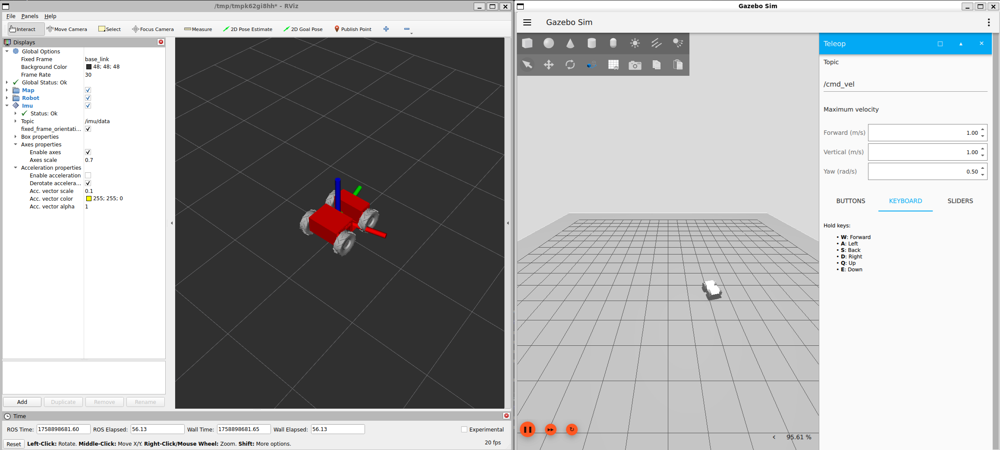

# rover_metapackage

ROS 2 Metapackage composing basic functionalities of the Mechatronics Academy rover with VCS Tool yaml files directing to external rover dependencies.

## Quick start

### Create workspace

```bash
mkdir -p ~/ros2_ws/rover_a1
cd ~/ros2_ws/rover_a1
git clone -b main https://github.com/RaduPotlog/rover_metapackage.git src/rover_metapackage
```

### Setup environment variables

Real rover:

export ROVER_ROS_BUILD_TYPE=hardware

Simulation:

```bash
export ROVER_ROS_BUILD_TYPE=simulation
```

### Build

```bash
vcs import src < src/rover_metapackage/${ROVER_ROS_BUILD_TYPE}_deps.repos

sudo rosdep init
rosdep update --rosdistro $ROS_DISTRO
rosdep install --from-paths src -y -i

source /opt/ros/$ROS_DISTRO/setup.bash
colcon build --symlink-install --packages-up-to rover_metapackage --cmake-args -DCMAKE_BUILD_TYPE=Release -DBUILD_TESTING=OFF

source install/setup.bash
```

### Running

Real rover:

```bash
ros2 launch rover_bringup rover_bringup.launch.py
```

Simulation:

```bash
ros2 launch rover_gazebo simulation.launch.py
```

### Rviz:

Real rover:


### Gazebo

Simulation:

